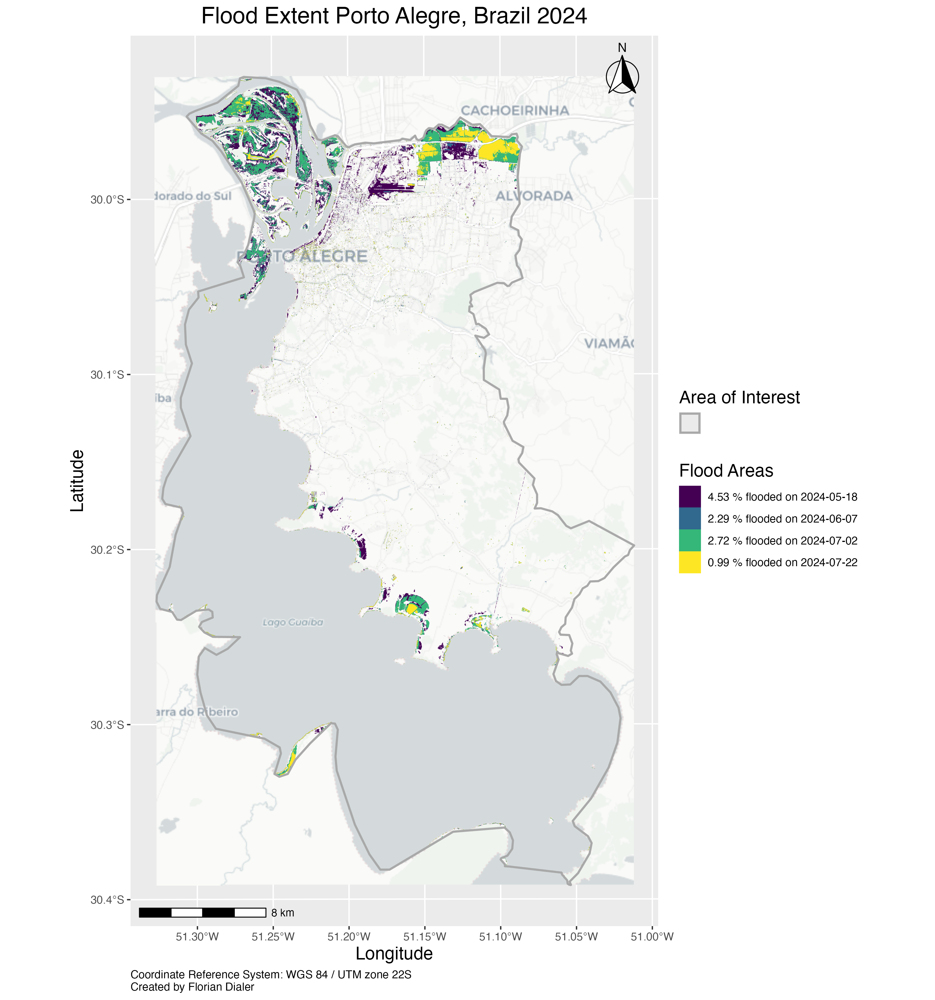

<!-- README.md is generated from README.Rmd. Please edit that file -->

```{r, include = FALSE}
knitr::opts_chunk$set(
  collapse = TRUE,
  comment = "#>",
  fig.path = "man/figures/README-",
  out.width = "100%"
)
```

# FloodPack: An R Package for Flood Analysis with Sentinel-2 Data


With **FloodPack** you can download and preprocess (cloud masking, AOI cropping, scene-mosaicking) Sentinel-2 data, calculate flooded areas for multiple dates and create a map for quick and professional visualization.

## Requirements

An account at: [Copernicus Dataspace](https://dataspace.copernicus.eu/) with valid username (e-mail) and password. Two-factor authentication is **NOT** supported.

Tested for and with R version 4.4.3 (Trophy Case)

## Installation

You can install **FloodPack** from [GitHub](https://github.com/) the following ways:

### Using Remotes

``` r
remotes::install_github("FlorianDialer/FloodPack")

library(FloodPack)
```

### Using Devtools

``` r
devtools::install_github("FlorianDialer/FloodPack")

library(FloodPack)
```

## Package Functions

| **Function Name** | **Description** |
|----------------------|--------------------------------------------------|
| S2_data_download() | Download Sentinel-2 data for Flood Mapping via the Copernicus API. You can define filter for AOIs, dates and cloud cover percentage. |
| S2_data_processing() | Processing of Sentinel-2 bands with automatic cloud masking, AOI cropping as well as scene-mosaicking. |
| SFMI_flood_calculation() | Calculation of flooded areas with SFMI Index by Farhadi et al. (2025). |
| FloodMap() | Create a map displaying calculated flood areas based on date or by flood size. |

## Example Workflow

This is a basic workflow example which shows you how to use **FloodPack**:

* This example can be recreated by downloading the following AOI shapefile by FAO GAUL (1990, 2014): [Link to GeoPackage](example_data/porto-alegre-AOI.zip)

### Package Preparation

```r
# LOAD THE PACKAGE:
library(FloodPack)

# Create a folder in your desired location and set the working directory to it
setwd("/Path/to/folder/to/store/data")

```

### S2_data_download()

```r
# DATA DOWNLOAD OF SENTINEL-2 TILES:

# Insert your e-mail address and password from Copernicus Dataspace
username <- "your_email@address.com"
password <- "your_password"

# The path to Area of Interest (AOI): the file you downloaded just now
aoi <- "path/to/porto-alegre-AOI.gpkg"

# Optional arguments
# Maximum percent of cloud cover over the satellite image
cloud_cover_percent <- 30
# How many images will be shown to you for choosing Sentinel-2 tile(s)
number_of_results <- 4
```

This example looks at the 2024 Rio Grande do Sul floods. Define which images you want to download (you need at least one image as a "pre_flood" and a "flood_xx" raster generally). Within this function you will be prompted to select the tiles you want to download. You can either download one tile or more by splitting the tile numbers with commas (,).
```r
# Only run one condition and start_ & end-date at a time and proceed to run S2_data_download() repeatedly to download the correct tiles

# pre_flood image: 2024-04-18
condition <- "pre_flood"
start_date <- "2024-04-15" # "YYYY-MM-DD"
end_date <- "2024-04-20" # "YYYY-MM-DD"

# flood_01 image: 2024-05-18 & 2024-05-21
condition <- "flood_01"
start_date <- "2024-05-17"
end_date <- "2024-05-22"

# flood_02 image: 2024-06-07
condition <- "flood_02"
start_date <- "2024-06-05"
end_date <- "2024-06-08"

# flood_03 image: 2024-07-02
condition <- "flood_03"
start_date <- "2024-07-01"
end_date <- "2024-07-03"

# flood_04 image: 2024-07-22
condition <- "flood_04"
start_date <- "2024-07-21"
end_date <- "2024-07-23"

# Run the function repeatedly with the conditions and start_ & end-date to download the tiles with the correct dates
S2_data_download(username = username, password = password, condition = condition, start_date = start_date, end_date = end_date, aoi = aoi, cloud_cover_percent = cloud_cover_percent, number_of_results = number_of_results)
```

### S2_data_processing()

```r
# DATA PROCESSING OF SENTINEL-2 TILES:

# Optional: define a mosaic_method (e.g. for creating a mean-value mosaic of a "pre_flood" raster), Default: minimum values get chosen for most effectively removing cloud artifacts, for more options check out the help page
mosaic_method <- "min"

# Run the function for automatic AOI cropping, cloud-masking and mosaic creation (if necessary)
# Optional: You can loop this function for faster processing:
conditions <- c("pre_flood", "flood_01", "flood_02", "flood_03", "flood_04")

for (con in conditions) {
  S2_data_processing(aoi = aoi, condition = con, mosaic_method = mosaic_method)
}

```

### SFMI_flood_calculation()

```r
# SFMI CALCULATION:

# Simply make sure that you are still in the correct working directory and you can run the next function for calculating flood areas; otherwise specify function argument "path_to_rasters"
SFMI_flood_calculation(aoi = aoi)

```

### FloodMap()

```r
# FLOODMAP CREATION:

# Define optional arguments if you want to enhance the map design (there are more than displayed here)
title <- "Flood Extent Porto Alegre, Brazil 2024"
map_file_name <- "porto_alegre"
sort_by_flood_size <- FALSE
caption_text <- "Created by You"

FloodMap(aoi = aoi, title = title, map_file_name = map_file_name, sort_by_flood_size = sort_by_flood_size, caption_text = caption_text)

# You should now have a map of the 2024 flood extent in Porto Alegre, Brazil, saved in your working directory's flood_map folder
# See the example below

# Consider trying out other Areas of your Interest!
```

### Result of Example:




## Limitations

* Tested for AOIs smaller than or equal to Sentinel-2 tiles (110 km x 110 km), larger AOIs may not work due to function design and Copernicus Dataspace API integration 

* Copernicus Dataspace two-factor authentication is currently **NOT** supported

* Package works only in UTF8 environment; certain Latin characters may cause errors (especially on Windows Operating Systems)

* If Sentinel-2 tiles have a different CRS there is currently an issue with scene-mosaicking which might break functionality. If this is the case for you please try different tiles with same CRS.


## References

* European Space Agency. (2022). Sentinel-2 MSI Level-2A BOA Reflectance [Dataset]. https://doi.org/10.5270/S2_-znk9xsj

* FAO GAUL. (1990, 2014). Administrative boundaries (level 2)—GAUL 2015—AmeriGEOSS Community Platform DataHub. https://data.amerigeoss.org/es_AR/dataset/a6baab0a-66b8-47ca-84a2-3553be80a574

* Farhadi, H., Ebadi, H., Kiani, A., & Asgary, A. (2025). Introducing a new index for flood mapping using Sentinel-2 imagery (SFMI). Computers & Geosciences, 194, 105742. https://doi.org/10.1016/j.cageo.2024.105742

## R packages references

* Schwalb-Willmann J (2024). _basemaps: Accessing Spatial Basemaps in R_. R package version 0.0.8, <https://CRAN.R-project.org/package=basemaps>.
  
* Wickham H, François R, Henry L, Müller K, Vaughan D (2023). _dplyr: A Grammar of Data Manipulation_. R package version 1.1.4, <https://CRAN.R-project.org/package=dplyr>.

* Hijmans RJ, Barbosa M, Ghosh A, Mandel A (2024). _geodata: Download Geographic Data_. R package version 0.6-2, <https://CRAN.R-project.org/package=geodata>.

* Wickham H (2016). _ggplot2: Elegant Graphics for Data Analysis_. Springer-Verlag New York, <https://ggplot2.tidyverse.org>.

* Dunnington D (2023). _ggspatial: Spatial Data Framework for ggplot2_. R package version 1.1.9, <https://CRAN.R-project.org/package=ggspatial>.

* Hester J, Bryan J (2024). _glue: Interpreted String Literals_. R package version 1.8.0, <https://CRAN.R-project.org/package=glue>.

* Wickham H (2023). _httr: Tools for Working with URLs and HTTP_. R package version 1.4.7, <https://CRAN.R-project.org/package=httr>.

* Pebesma E, Bivand R (2023). _Spatial Data Science: With Applications in R_. Chapman and Hall/CRC. <https://doi.org/10.1201/9780429459016>.

* Pebesma E (2018). _Simple Features for R: Standardized Support for Spatial Vector Data_. The R Journal 10(1), 439–446. <https://doi.org/10.32614/RJ-2018-009>.

* Wickham H (2023). _stringr: Simple, Consistent Wrappers for Common String Operations_. R package version 1.5.1, <https://CRAN.R-project.org/package=stringr>.

* Hijmans R (2025). _terra: Spatial Data Analysis_. R package version 1.8-42, <https://CRAN.R-project.org/package=terra>.

* Hernangómez D (2023). _Using the tidyverse with terra objects: the tidyterra package_. Journal of Open Source Software, 8(91), 5751. <https://doi.org/10.21105/joss.05751>.

* R Core Team (2025). _R: A Language and Environment for Statistical Computing_. R Foundation for Statistical Computing, Vienna, Austria. <https://www.R-project.org/>.

* Temple Lang D (2025). _XML: Tools for Parsing and Generating XML Within R and S-Plus_. R package version 3.99-0.18, <https://CRAN.R-project.org/package=XML>.

## License

MIT License: Copyright (c) 2025 Florian Dialer

## Additional Information

This is the final project for the course **Introduction to Programming and Statistics for Remote Sensing and GIS (2024)** at the Julius Maximilian University of Wuerzburg **EAGLE programme**
