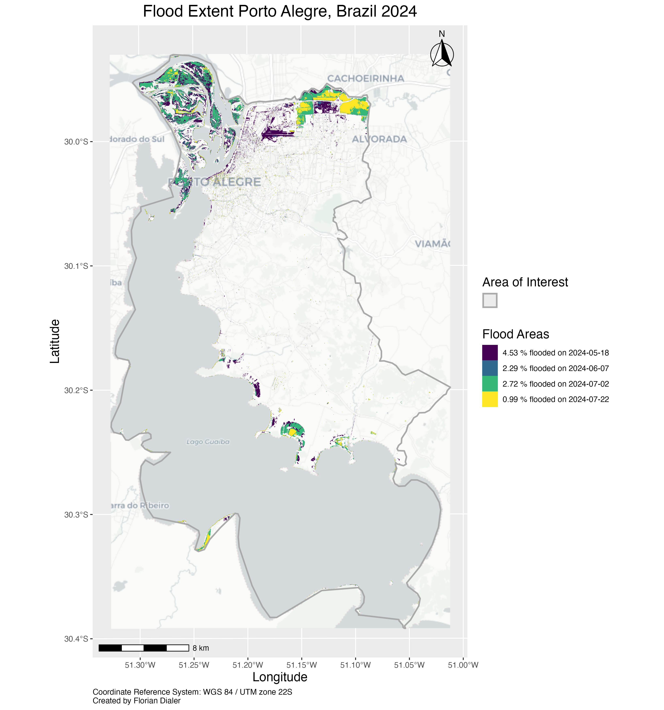

<!-- README.md is generated from README.Rmd. Please edit that file -->

# FloodPack: An R Package for Flood Analysis with Sentinel-2 Data


With **FloodPack** you can download and preprocess (Cloud Masking, AOI
Cropping, Mosaic-Building) Sentinel-2 Data, calculate flooded Areas for
multiple dates and create a Map for quick and professional
Visualization.

## Requirements

An Account at: [Copernicus Dataspace](https://dataspace.copernicus.eu/)
with valid Username (E-Mail) and Password. Two-factor authentication is
**NOT** supported.

Tested for and with R version 4.4.3 (Trophy Case)

## Installation

You can install **FloodPack** from [GitHub](https://github.com/) the
following ways:

### Using Remotes

``` r
remotes::install_github("FlorianDialer/FloodPack")

library(FloodPack)
```

### Using Devtools

``` r
devtools::install_github("FlorianDialer/FloodPack")

library(FloodPack)
```

## Package Functions

| **Function Name** | **Description** |
|----|----|
| S2_data_download() | Download Sentinel-2 Data for Flood Mapping via the Copernicus API. You can define filter for AOIs, dates and Cloud Cover percentage. |
| S2_data_processing() | Processing of Sentinel-2 Bands with automatic Cloud Masking, AOI Cropping as well as Mosaic-Building. |
| SFMI_flood_calculation() | Calculation of flooded Areas with SFMI Index by Farhadi et al. (2025). |
| FloodMap() | Create a Map displaying calculated Flood Areas based on Date or by Flood Size. |

## Example Workflow

This is a basic workflow example which shows you how use **FloodPack**:

- This example can be recreated by downloading the following AOI
  Shapefile by FAO GAUL (1990, 2014): [Link to
  GeoPackage](https://1drv.ms/u/c/1bda63fd85cbfc63/EXSrkHSO-6dFuGRboezatA0BkoMTTt4wqjtwuER4nhD0mw?e=GPJsa2)

### Package Preparation

``` r
# LOAD THE PACKAGE:
library(FloodPack)

# Create a folder in your deaired location and set the working directory to it
setwd("/Path/to/folder/to/store/data")
```

### S2_data_download()

``` r
# DATA DOWNLOAD OF SENTINEL-2 TILES:

# Insert your e-mail address and password from Copernicus Dataspace
username <- "your_email@address.com"
password <- "your_password"

# The path to Area of Interest (AOI): the file you downloaded just now
aoi <- "path/to/porto-alegre-AOI.gpkg"

# Optional arguments
# Maximum percent of cloud cover over the satellite image
cloud_cover_percent <- 30
# How many images will be shown to you for choosing Sentinel-2 tile(s)
number_of_results <- 4


# This example looks at the 2024 Rio Grande do Sul floods 
# Define which image you want to download (you need at least one image as a "pre_flood" and a "flood_xx" raster generally)

# Only run one condition and start_ & end-date at a time and proceed to run S2_data_download() repeatedly to download the correct tiles

# pre_flood image: 2024-04-18
condition <- "pre_flood"
start_date <- "2024-04-15" # "YYYY-MM-DD"
end_date <- "2024-04-20" # "YYYY-MM-DD"

# flood_01 image: 2024-05-18 & 2024-05-21
condition <- "flood_01"
start_date <- "2024-05-17"
end_date <- "2024-05-22"

# flood_02 image: 2024-06-07
condition <- "flood_02"
start_date <- "2024-06-05"
end_date <- "2024-06-08"

# flood_03 image: 2024-07-02
condition <- "flood_03"
start_date <- "2024-07-01"
end_date <- "2024-07-03"

# flood_04 image: 2024-07-22
condition <- "flood_04"
start_date <- "2024-07-21"
end_date <- "2024-07-23"

# Run the function repeatedly with the conditions and start_ & end-date to download the correctly dated tiles
S2_data_download(username = username, password = password, condition = condition, start_date = start_date, end_date = end_date, aoi = aoi, cloud_cover_percent = cloud_cover_percent, number_of_results = number_of_results)
```

### S2_data_processing()

``` r
# DATA PROCESSING OF SENTINEL-2 TILES:

# Optional: define a mosaic_method (e.g. for creating a mean mosaic of a "pre_flood" raster), Default: minimum values get chosen for most effectively removing cloud artifacts, for more options check out the help page
mosaic_method <- "min"

# Run the function for automatic AOI cropping, cloud-masking and mosaic creation (if necessary)
# Optional: You can loop this function for faster processing:
conditions <- c("pre_flood", "flood_01", "flood_02", "flood_03", "flood_04")

for (con in conditions) {
  S2_data_processing(aoi = aoi, condition = con, mosaic_method = mosaic_method)
}
```

### SFMI_flood_calculation()

``` r
# SFMI CALCULATION:

# Simply make sure that you are still in the correct working directory and you can run the next function for calculating flood areas; otherwise specify function argument "path_to_rasters"
SFMI_flood_calculation(aoi = aoi)
```

### FloodMap()

``` r
# FLOODMAP CREATION:

# Define optional arguments if you want to enhance the map design (there are more than displayed here)
title <- "Flood Extent Porto Alegre, Brazil 2024"
map_file_name <- "porto_alegre"
sort_by_flood_size <- FALSE
caption_text <- "Created by You"

FloodMap(aoi = aoi, title = title, map_file_name = map_file_name, sort_by_flood_size = sort_by_flood_size, caption_text = caption_text)

# You should now have a map with the flood extent of Porto Alegre, Brazil 2024 in your working directory flood_map folder
# See the example below

# Consider trying out other Areas of your Interest!
```

### Result of Example: Map



## Limitations

- Tested for AOIs smaller than or equal Sentinel-2 tiles (110 km x 110
  km), larger AOIs may not work due to function design, Copernicus
  Dataspace API or local computational limitations

- Copernicus Dataspace two-factor authentication is currently **NOT**
  supported

- Package works only in UTF8 environmet; certain Latin characters may
  cause errors (especially on Windows Operating Systems)

## References

- European Space Agency. (2022). Sentinel-2 MSI Level-2A BOA Reflectance
  \[Dataset\]. <https://doi.org/10.5270/S2_-znk9xsj>

- Farhadi, H., Ebadi, H., Kiani, A., & Asgary, A. (2025). Introducing a
  new index for flood mapping using Sentinel-2 imagery (SFMI). Computers
  & Geosciences, 194, 105742.
  <https://doi.org/10.1016/j.cageo.2024.105742>

- FAO GAUL. (1990, 2014). Administrative boundaries (level 2)—GAUL
  2015—AmeriGEOSS Community Platform DataHub.
  <https://data.amerigeoss.org/es_AR/dataset/a6baab0a-66b8-47ca-84a2-3553be80a574>

## License

MIT License: Copyright (c) 2025 Florian Dialer

## Additional Information

This is the final project for the course **Introduction to Programming
and Statistics for Remote Sensing and GIS (2024)** at the Julius
Maximilian University of Wuerzburg **EAGLE programme**
